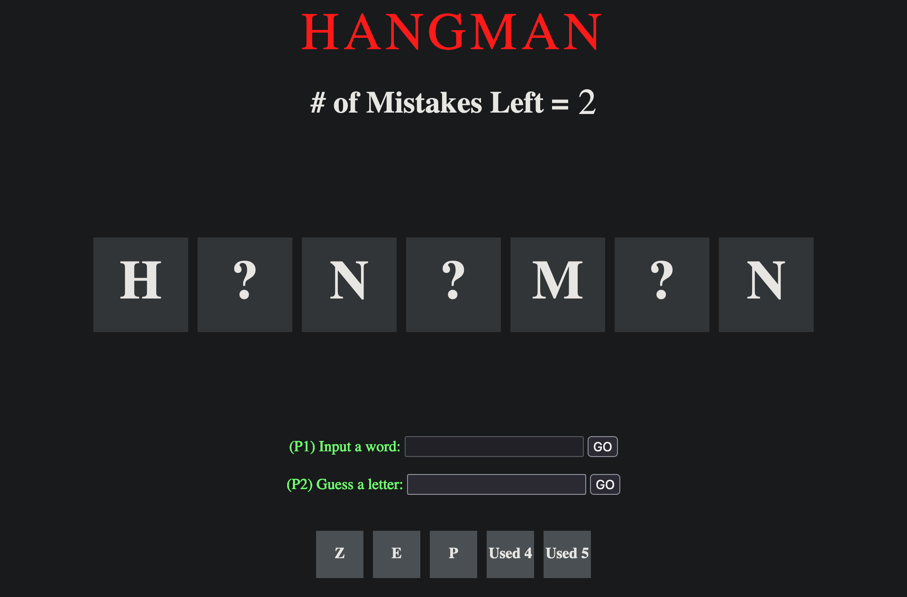

# HANGMAN

    

## DESCRIPTION
The classic game of HANGMAN. Player 1 chooses a secret word and Player 2 tries to guess the word 1 letter at a time. If Player 2 correctly guesses the word before their 5 wrong guesses are used up, Player 2 wins. Otherwise, Player 1 is the champion.

## GAMEPLAY

## TECHNOLOGIES USED
1. HTML
2. CSS
3. JavaScript

## UPCOMING FEATURES
P1 vs COMPUTER
